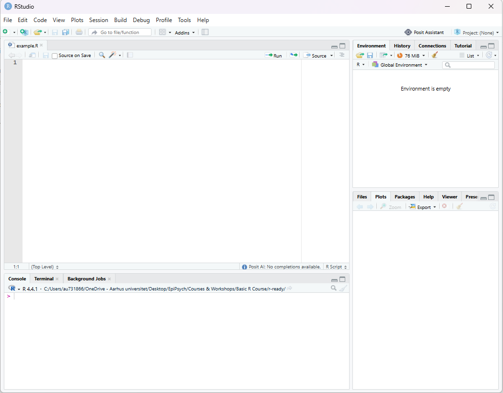

::: {.mission-meta}
⏱️ About 10 minutes · do this in RStudio
:::

## The idea

Every analysis needs a home base — one folder that contains everything it needs: the data, the code, the output. In RStudio, that home base is called a **Project**.

> 📁 **Project folder** = the home of your analysis
> 📁 **data/** = where your data lives
> 📁 **R/** = where your scripts live
> 📁 **figures/** = where output can go

Without a project, R doesn't know where "home" is, and you end up typing full file paths like `C:/Users/Anna/Desktop/finally/actual-project-v2-FINAL/` — which breaks the moment you rename a folder, move the project, or open it on a different computer. A project fixes that: everything is found *relative to* the project, so the folder can move, get renamed, or get zipped and sent to a collaborator, and it still works.

::: {.callout-tip}
## Why not just use folders on your Desktop?
You can — RStudio doesn't force you to use Projects. But without one, R's "starting point" (see [Mission 2](02-paths.qmd)) is whatever folder happened to be active when RStudio launched, which changes unpredictably. A Project pins that starting point to one fixed place.
:::

## Your task

Create this exact structure:

```text
my-first-r-project/
│
├── my-first-r-project.Rproj
│
├── data/
│   └── participants.csv
│
├── R/
│   └── analysis.R
│
└── figures/
```

**Step by step:**

1. Open RStudio.
2. Go to **File → New Project… → New Directory → New Project**.
3. Name it `my-first-r-project` and choose where to save it (Desktop or Documents is fine).
4. Click **Create Project**. RStudio will reopen inside your new project — check the top-right corner, it should now show `my-first-r-project`.
5. In the **Files** pane (bottom-right), click **New Folder** and create two folders: `data` and `figures`.
6. Create a folder called `R`, and inside it, a new R script: **File → New File → R Script**, save it as `R/analysis.R`.
7. **[⬇ Download participants.csv](../downloads/participants.csv)** and save it into your `data/` folder. (A file you find yourself might not open cleanly — this one's guaranteed to work, and you'll use it again in later missions.)

::: {.callout-important}
## The one habit that prevents 90% of "R can't find my stuff" problems
Always open your project by double-clicking the **`.Rproj` file** — never by opening a loose `.R` script directly. Opening the `.Rproj` file is what tells R "start here." Opening a script by itself doesn't.
:::

## Where do I actually type code?

RStudio's window is split into panes. You only need to know two of them for now:

```{=html}
<div class="rr-diagram rr-diagram-photo">

<span class="rr-pane-box rr-pane-primary" style="left:0.3%;top:11.4%;width:69.6%;height:57.5%"></span>
<span class="rr-pane-box rr-pane-primary" style="left:0.3%;top:70.5%;width:69.6%;height:29%"></span>
<span class="rr-pane-box rr-pane-secondary" style="left:70.2%;top:11.4%;width:29.5%;height:36.2%"></span>
<span class="rr-pane-box rr-pane-secondary" style="left:70.2%;top:49.4%;width:29.5%;height:50%"></span>
<span class="rr-pane-badge" style="left:1.5%;top:13.5%">①</span>
<span class="rr-pane-badge" style="left:1.5%;top:72.5%">②</span>
<span class="rr-pane-badge rr-pane-badge-muted" style="left:71.5%;top:13.5%">③</span>
<span class="rr-pane-badge rr-pane-badge-muted" style="left:71.5%;top:51%">④</span>
</div>
```
*(This is a real screenshot from this project's own RStudio — R 4.4.1, `Project: (None)` in the top-right, which is exactly the "before you make a Project" state this mission fixes.)*

- **① Source** — a text editor for your `.R` script. Nothing here runs on its own; it's just saved text until you tell R to run it.
- **② Console** — where code is actually *executed*, one command at a time. Anything you type directly here runs the instant you press Enter.
- The connection between them: put your cursor on a line in the Source pane and press **Ctrl+Enter** (Windows) or **⌘+Enter** (Mac) — or click the **Run** button — and that line gets sent down to the Console and runs.

::: {.callout-note collapse="true"}
## What are Environment and Files/Plots/Help for?
Not essential today, but for context: **③ Environment** lists every object R currently has in memory (you'll create your first ones in [Mission 3](03-language.qmd)). **④ Files/Plots/Help** is a set of tabs — browse folders, view any plots you make, or read a function's documentation.
:::

### Try both

In `R/analysis.R`:

1. Type `2 + 2` and press **Ctrl+Enter** (or **⌘+Enter**) with your cursor on that line. Watch it appear in the Console below, with the answer.
2. Now click directly **in the Console** itself, type `2 + 2` again, and press **Enter**.

Same result, two different starting points. The difference that matters: only what you write in the **script** gets saved when you save the file — anything typed straight into the Console is gone the moment you close RStudio. That's why real work goes in the script, and the Console is more for quick one-off checks.

## Check yourself

- [ ] Your project has a `.Rproj` file at the top level.
- [ ] You have `data/`, `R/`, and `figures/` folders inside it.
- [ ] The top-right corner of RStudio shows your project's name — not "Project: (None)".

If all three are true, you're done. If RStudio says "Project: (None)", you opened a file instead of the project — close RStudio, find `my-first-r-project.Rproj` in your file explorer, and double-click *that*.

Next up: [Mission 2 — Help R find your files →](02-paths.qmd)
